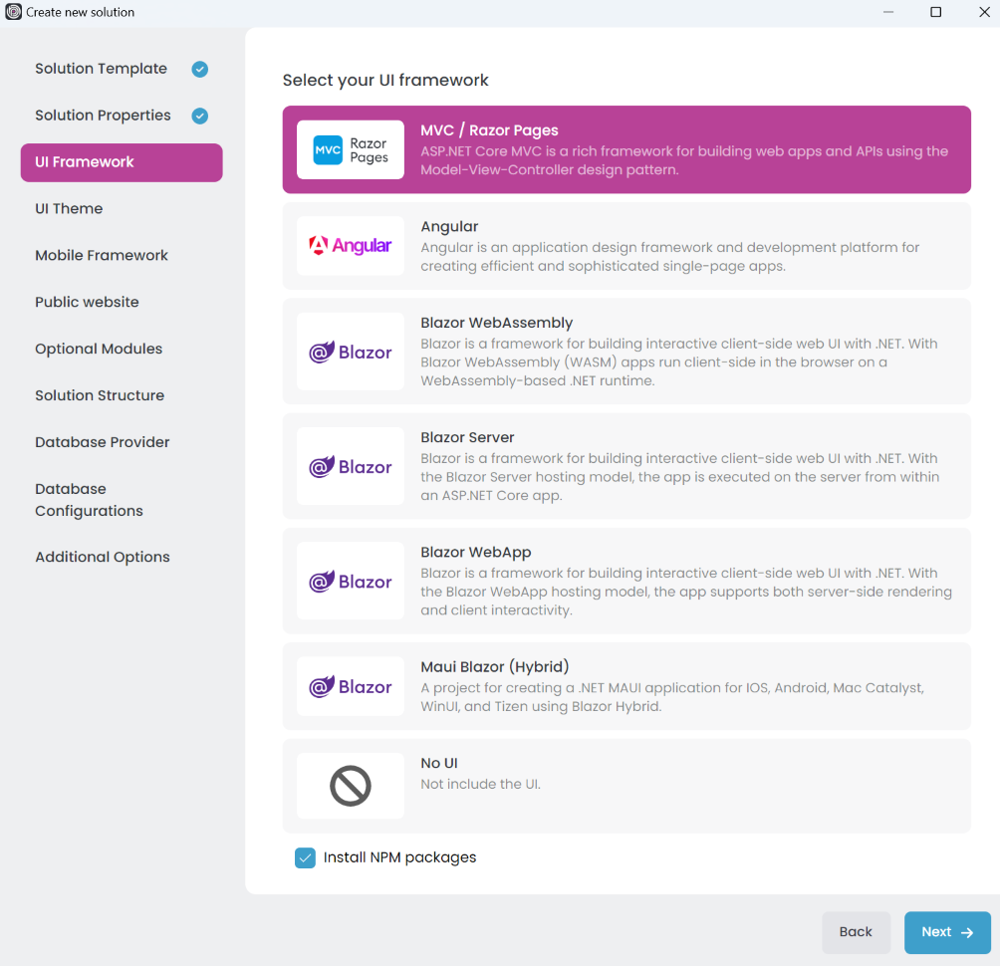

# Layered Solution: Web Applications

The web applications are the main user interfaces of the solution. They are the entry points for users to interact with the system. The Layered Solution Template supports the following web applications:

- **MVC / Razor Pages**: This is an ASP.NET Core MVC application. It is a traditional web application that serves HTML pages to users and is suitable for building web applications with server-side rendering.  
- **Angular**: This is an Angular application, a single-page application (SPA) that runs on the client side. It communicates with the server using HTTP requests and is ideal for building modern web applications with rich user interfaces.  
- **Blazor UI**: A flexible framework for building web applications with .NET. It supports various hosting models:
  - **Blazor WebAssembly**: This is a client-side SPA that runs entirely in the user's browser. It communicates with the server using HTTP requests and is suitable for modern web applications with rich interactivity and offline capabilities.  
  - **Blazor Server**: This is a server-side SPA that runs on the server and communicates with the client in real time using SignalR. It is ideal for applications requiring constant connectivity and rapid server updates.  
  - **Blazor WebApp**: This is a combination of Blazor technologies optimized for building hybrid web applications that can leverage both client-side and server-side capabilities.  
  - **Maui Blazor (Hybrid)**: This enables building cross-platform applications that combine Blazor for the UI with .NET MAUI for native device integration. It is suitable for building apps that work across desktop and mobile platforms.  
- **No UI**: This option creates a backend-only solution without a web interface, suitable for scenarios like API-only applications or headless services.  

You can select the web application type that fits your requirements during the solution creation process in the *UI Framework* step. The Layered Solution Template generates the selected web applications with the necessary configurations and integrations.

## MVC / Razor Pages

MVC (Model-View-Controller) is a design pattern commonly used for building web applications. Razor Pages, on the other hand, is a page-based programming model designed to make building web applications simpler and more productive.  

When you select the MVC / Razor Pages option in the Layered Solution Template, it generates an ASP.NET Core MVC application named something like `Acme.BookStore.Web`. This application serves as the web interface for your solution, using server-side rendering to deliver dynamic HTML pages to users.

