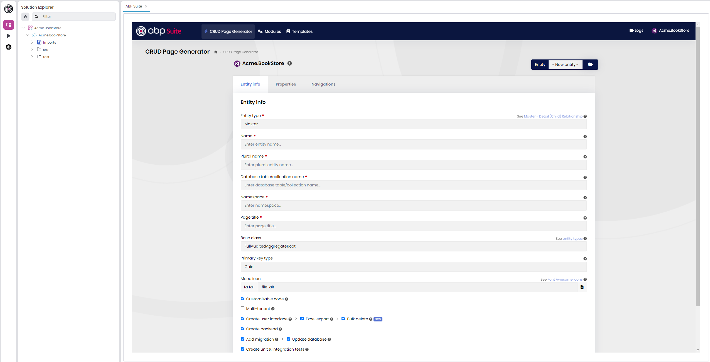
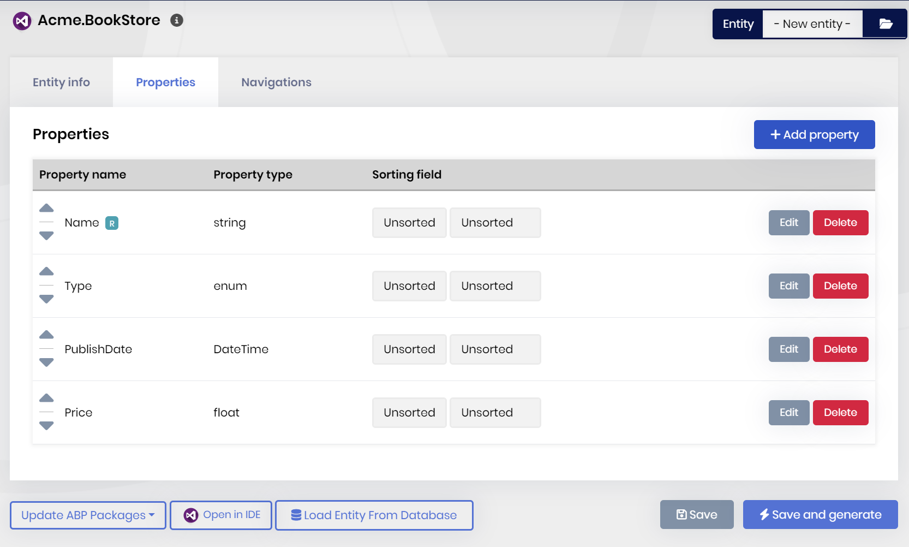
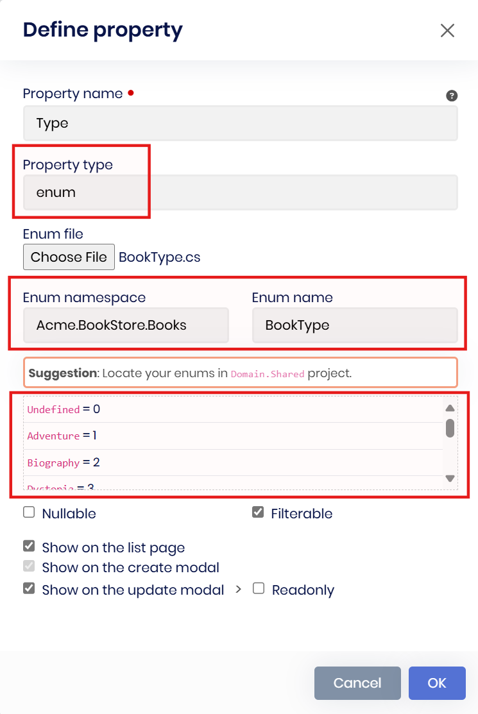

# Web Application Development (with ABP Suite) Tutorial - Part 2: Creating the Books
````json
//[doc-params]
{
    "UI": ["MVC"],
    "DB": ["EF"]
}
````
````json
//[doc-nav]
{
  "Previous": {
    "Name": "Creating the Solution",
    "Path": "tutorials/book-store-with-abp-suite/part-01"
  },
  "Next": {
    "Name": "Creating the Authors",
    "Path": "tutorials/book-store-with-abp-suite/part-03"
  }
}
````

In this part, you will create a new entity named `Book` and generate CRUD pages for the related entities with everything that you would normally implement manually (including application services, tests, CRUD pages, database relations and more...) via [ABP Suite](../../suite/index.md) with few clicks.

## Opening the ABP Suite

> Please **stop the application** in ABP Studio's *Solution Runner* panel, if it's currently running, because ABP Suite will make changes in the solution and it might need to build the solution in some steps and running the solution prevents to build it.

After creating the solution in the previous part, now you can open the ABP Suite and start generating CRUD pages. You can select the *ABP Suite -> Open* command on the main menu to open ABP Suite:


After clicking the related command, pre-integrated browser of ABP Studio should open, then you can start generating entities and all related codes with a few configurations:



## Creating the Book Entity

Before creating the `Book` entity, first we can create a `BookType` enum in the `Acme.BookStore.Domain.Shared` project under the **Books** folder as follows:

```csharp
namespace Acme.BookStore.Books;

public enum BookType
{
    Undefined,
    Adventure,
    Biography,
    Dystopia,
    Fantastic,
    Horror,
    Science,
    ScienceFiction,
    Poetry
}
```

After creating an _enum_ file in your project, you can define it as a property while creating the entity. ABP Suite asks for an enum path to read the enum file, and set the namespace, and enum name in the generated code accordingly. Then, you can create the `Book` entity with some properties. 

Type `Book` for the *Name* field and leave the other options as is. ABP Suite automatically calculates proper values for the rest of the inputs for you:


ABP Suite sets:

* Entity type as **master** (ABP Suite allows you to establish [master-child relationship](../../suite/creating-master-detail-relationship.md)),
* Base class as **FullAuditedAggregateRoot** ([see other possible values](../../framework/architecture/domain-driven-design/entities.md)),
* Primary key type as **Guid**,
* Plural name, database name, namespace, page title, menu item and more...

You can change the menu-item value as **book** to show a proper icon in the generated UI, and also enable **code customization**, **creating unit & integration tests**, and other options as you wish:


After, specifying the entity metadata, open the *Properties* tab and create the properties shown in the following figure:



While defining the properties, you define a *Type* property with the type of *enum*. ABP Suite asks for an enum path and fill the all other inputs by reading the specified enum file. Therefore, you can specify the enum path for the `Type` property like in the following figure:



> After you select the enum file, ABP Suite automatically sets the namespace and enum name, and lists your enum values in the next section. You can change these values, but for now, you can leave as is.

Here is the all details for the `Book` entity:

* `Name` is **required**, it's a **string** property and maximum length is **128**.
* `Type` is an **enum** and the enum file path is *\Acme.BookStore.Domain.Shared\Books\BookType.cs*.
* `PublishDate` is a **DateTime** property and **not nullable**.
* `Price` is a **float** property and **required**.

You can leave the other configurations as default.

> ABP Suite allows you to define properties with a great range of options, for example, you can specify the property type as *string*, *int*, *float*, *Guid*, *DateTime*, and even *File* (for file upload) and also you can set any options while defining your properties, such as specifying it as *required*, or *nullable*, setting *max-min length*, *default value* and more...

After that, you can click the **Save and Generate** button to start the code generation process:


ABP Suite will generate the necessary code for you. It generates:

* `Book` entity (also `BookBase` class, which is allow you customizing the generated entity),
* Repository implementation (`EfCoreBookRepository` class),
* `BookManager` domain service,
* Input & Output **DTOs** and **application service** implementations (`IBookAppService` & `BookAppService`),
* **Unit & integration tests**,
* A new **migration** (and also applies to the database),
* All related **permission**, **object mapping** and **navigation menu item** configurations,
* and all required **UI components and pages**...

It will take some time to complete the process. After the process is completed, you will see a success message, you can click the *Ok* button, and build & start the application by clicking the *Run -> Build & Start* button in the *Solution Runner* panel:


After the application is started, you can right-click and *Browse* on the application to open it in the ABP Studio's pre-integrated browser. You can see the Books page in the following figure with a single record:


On this page, you can create a new book, update an existing book, delete a book, export all records (or the filtered records) to excel, filter the records by using the advanced filter section, bulk delete multiple records and so on.

## Summary

In this part, you've created a new entity named `Book` and generated the necessary code for it with [ABP Suite](../../suite/index.md) with a few clicks. ABP Suite generated the all code for you, including the **entity**, **application service**, **database relations**, **unit & integration tests**, **UI** and **defined the custom hooks for code customization**.