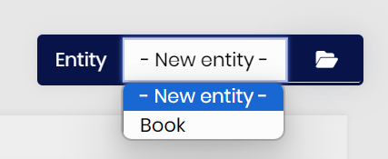
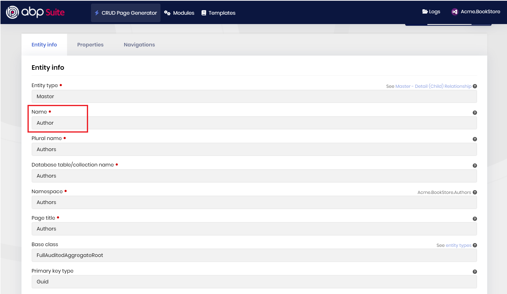
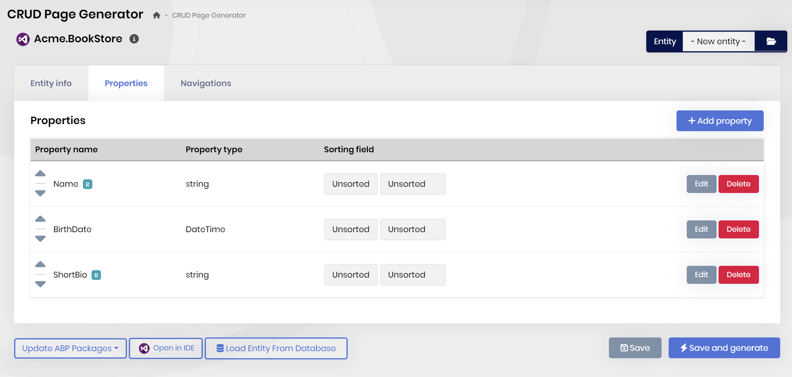
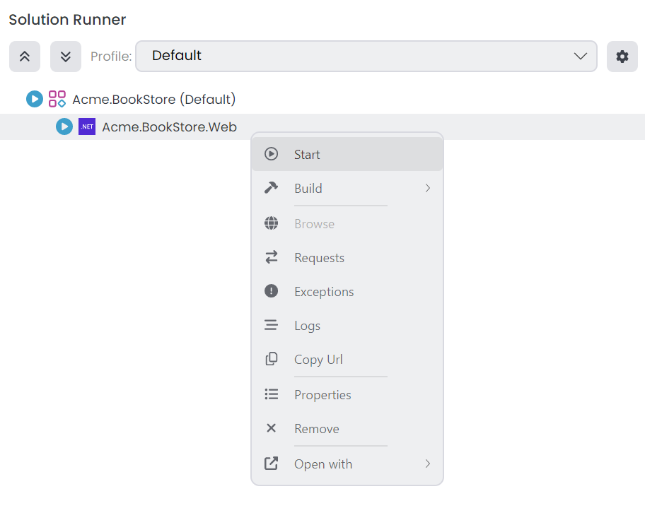
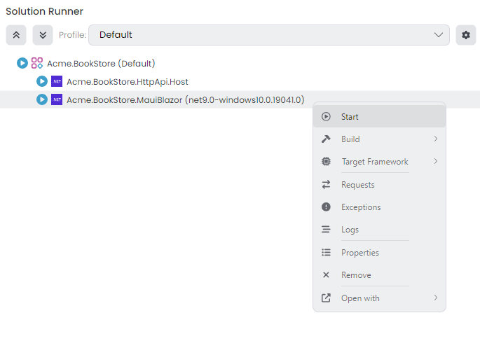
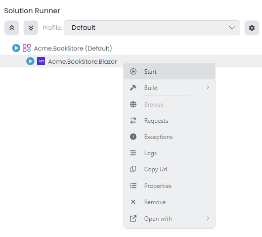
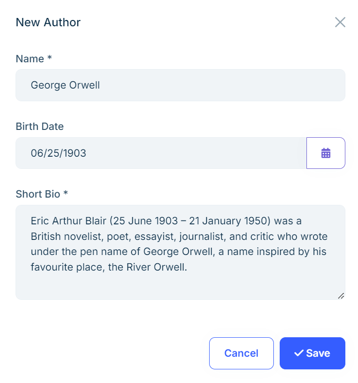

# Web Application Development Tutorial (with ABP Suite) - Part 3: Creating the Authors

````json
//[doc-params]
{
    "UI": ["MVC","Blazor","BlazorServer", "BlazorWebApp","NG","MAUIBlazor"],
    "DB": ["EF", "Mongo"]
}
````

````json
//[doc-nav]
{
  "Previous": {
    "Name": "Creating the Books",
    "Path": "tutorials/book-store-with-abp-suite/part-02"
  },
  "Next": {
    "Name": "Book to Author Relation",
    "Path": "tutorials/book-store-with-abp-suite/part-04"
  }
}
````

In the previous part, you have created the `Book` entity and in this part, you will create a new entity named `Author` and generate all necesssary code via [ABP Suite](../../suite/index.md) with few clicks. After creating the `Author` entity, you will be establishing [one-to-many relationship](../../suite/generating-crud-page.md#step-by-step-creating-a-navigation-property-with-1-to-many-relationship) with *Book* and *Author* entities, in the next part.

## Creating the Author Entity

After generating the all necessary code for the `Book` entity, and testing the *Books* page, by building & starting the application, now you can continue with creating the `Author` entity.

> Before, creating the `Author` entity, please **stop the application** in ABP Studio's *Solution Runner* panel, because ABP Suite will make changes in the solution and it might need to build the solution in some steps and running the solution prevents to build it.

Click the entity selection box in the top right of the *CRUD page generation* page, and select the *-New entity-*:



Then, you can type `Author` for the *Name* field and leave the other options as is (you can change the menu icon as **pen** for a proper menu icon, and/or other options, if you wish). ABP Suite automatically calculates proper values for the rest of the inputs for you:



ABP Suite sets:

* Entity type as **master** (ABP Suite allows you to establish [master-child relationship](../../suite/creating-master-detail-relationship.md)),
* Base class as **FullAuditedAggregateRoot** ([see other possible values](../../framework/architecture/domain-driven-design/entities.md)),
* Primary key type as **Guid**,
* Plural name, database name, namespace, page title, menu item and more...
* Also, it enables **code customization**, **UI code generation**, **unit & integration test generation** and **bulk delete** by default.

After, specifying the entity metadata, open the *Properties* tab and create the properties shown in the following figure:



Here the details:

* `Name` is **required**, it's a **string** property. Minimum length is **2** and maximum length is **128**.
* `BirthDate` is a **DateTime** property and **not nullable**.
* `ShortBio` is **required**, it's a **string** property, it's a **textarea**, maximum length is **256**. 

You can leave the other configurations as default.

> **Note:** All properties are marked as **filterable** by default, and they appear in the advanced filter section because of that. You can set any properties you want as **not filterable** and then the related property will be removed from the advanced filter section and code will be generated accordingly.

You can click the **Save and Generate** button to start the code generation process.

ABP Suite will generate the necessary code for you. It will take some time to complete the process. After the process is completed, you will see a success message, you can click the *Ok* button, and then run the application by clicking the *Start* button (or alternatively, directly clicking the *run* icon) in the *Solution Runner* panel:

{{ if UI === "MVC"}}

{{ else if UI === "Angular" }}

{{ else if UI === "MAUIBlazor" "}}

{{ else }}

{{ end }}

After the application is started, you can right-click and *Browse* on the application to open it in the ABP Studio's pre-integrated browser and try to add a new author:



As you can see, the *Name* field is **required**, the *Birth Date* field shows a datepicker, and the *Short Bio* field is also **required** and it's a **textarea**. You just configured how you want your properties with some options (for example, setting the short bio as **textarea** and **required**), and ABP Suite generated code according that.

## Summary

In this part, you've created a new entity named `Author` and generated the necessary code for it with [ABP Suite](../../suite/index.md) with a few clicks. ABP Suite generated the all code for you, including the **entity**, **application service**, **database relations**, **unit & integration tests**, **UI** and **defined the custom hooks for code customization**.

In the next part, you will establish [one-to-many relation](../../suite/generating-crud-page.md) between the `Book` and `Author` entities.