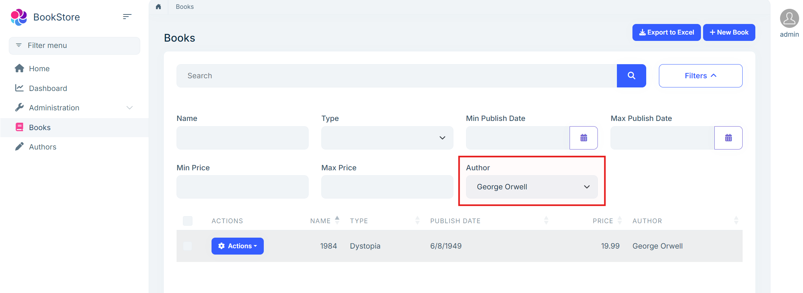
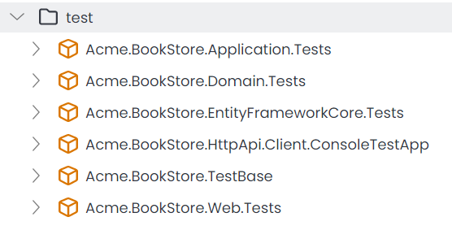
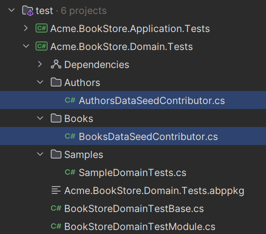

# Web Application Development (with ABP Suite) Tutorial - Part 4: Book to Author Relation
````json
//[doc-params]
{
    "UI": ["MVC"],
    "DB": ["EF"]
}
````
````json
//[doc-nav]
{
  "Previous": {
    "Name": "Creating the Author",
    "Path": "tutorials/book-store-with-abp-suite/part-03"
  },
  "Next": {
    "Name": "Customizing the Generated Code",
    "Path": "tutorials/book-store-with-abp-suite/part-05"
  }
}
````

In the previous parts, you have created the `Book` and `Author` entities (& generated code for all functionalities) for the book store application. However, currently there is no relation between these entities.

In this part, you will establish to **one-to-many relation** between the `Book` and `Author` entities.

## Establishing Relations with ABP Suite

ABP Suite allows establishing both **one-to-many** and [many-to-many](../../suite/creating-many-to-many-relationship.md) relationships. 

In this tutorial, you will only establish **one-to-many relation** between `Book` and `Author` entities. It's pretty straightforward to establish a relationship with ABP Suite. You should just need to navigate to the *Navigations* tab, and provide the metadata for navigation property (1-n) or navigation collection (n-n) relations.

## Creating Book to Author Relationship

> Please **stop the application** in ABP Studio's *Solution Runner* panel, because ABP Suite will make changes in the solution and it might need to build the solution in some steps and running the solution prevents to build it.

To establish **one-to-many relations** between *Book* and *Author* entities, select the `Book` entity from the entity selection box on the top-right of the *CRUD page generation* page:


Then, you can open the *Navigations* tab, and click the **Add navigation property (1-n)** button. After that, a navigation property model will open, and you can fill the fields like in the following figure:


Here is the details:

* Selected the entity as `Author`. (ABP Suite will establish one-to-many relation between *Book* and *Author* entities with this configuration)
* Set the property name as *AuthorId*, it will be set as foreign-key restriction in the database and all related database configurations will be made by ABP Suite.
* Selected the display property as *Name*, this will be used in the dropdown component to set an author with a book & also it will be shown in the datatable of the *Books* page. 
* Also, made the relation **required** and set it **filterable** so books can be filterable by authors.

After, specifying the metadata, you can click the *Ok* button to close the modal. Then, click the **Save and generate** button to start code generation process. ABP Suite will establish one-to-many relationship between the entities, and will generate all necessary code automatically:


It will take some time to complete the process. After the process is completed, you will see a success message, you can click the *Ok* button, and build & start the application by clicking the *Run -> Build & Start* button in the *Solution Runner* panel:


After the application is started, you can right-click and *Browse* on the application to open it in the ABP Studio's pre-integrated browser. You can first create an author and then create a book with the author for testing:


Also, notice that, in the advanced filter section, there is an **Author** dropdown, which you can use to filter books by authors (remember you set **filterable** while defining navigation property and thanks to that, ABP Suite generated the code accordingly):



## Unit & Integration Tests

Since you completed the bookstore application, now we can check the generated tests, and run them to see if all of them pass or not.

There are several test projects in the solution:



> Test projects slightly differs based on your UI and Database selection. For example, if you select MongoDB, then the `Acme.BookStore.EntityFrameworkCore.Tests` will be `Acme.BookStore.MongoDB.Tests`.

ABP Suite generated unit & integration tests, for the `Book` & `Author` entities. If you open the **Test explorer** in your IDE, you will see the following tests are generated:


ABP Suite generated tests for repository implementations & application service implementations for the generated code, if you enable *Create unit & integration tests* option, while creating the entity. Since, you already did that in the previous parts, it generated the all required tests for the entities.

Let's examine one of the generated test classes. Open the *BooksAppServiceTests* (under the *test/Acme.BookStore.Application.Tests/Books/BookApplicationTests.cs*) and check the `CreateAsync` method:

```csharp
        [Fact]
        public async Task CreateAsync()
        {
            // Arrange
            var input = new BookCreateDto
            {
                Name = "6c3d1eda8bf04852b7bd5dfdbbd93224b252478c2e474d4c8faf24fa6b182168ca830d4f80e64e4a8e363f33e151d1d34a04be4709274c7fbf2214f9bb3a16c3",
                Type = default,
                PublishDate = new DateTime(2006, 8, 21),
                Price = 754882891,
                AuthorId = Guid.Parse("602460f6-df6e-456a-89d9-8c5870dfc583")
            };

            // Act
            var serviceResult = await _booksAppService.CreateAsync(input);

            // Assert
            var result = await _bookRepository.FindAsync(c => c.Id == serviceResult.Id);

            result.ShouldNotBe(null);
            result.Name.ShouldBe("6c3d1eda8bf04852b7bd5dfdbbd93224b252478c2e474d4c8faf24fa6b182168ca830d4f80e64e4a8e363f33e151d1d34a04be4709274c7fbf2214f9bb3a16c3");
            result.Type.ShouldBe(default);
            result.PublishDate.ShouldBe(new DateTime(2006, 8, 21));
            result.Price.ShouldBe(754882891);
        }
```

ABP Suite;

* Create the `BookCreateDto` input DTO object, and fill its values with dummy data to simulate creating a book,
* Then, it calls the `IBooksAppService.CreateAsync` method to create a book,
* And finally, asserts the returned result to see if it's as expected or not.

Notice, also the *AuthorId* is set in the `BookCreateDto` object. At that point, you might ask yourself that I haven't created the author with that ID before, should not it throw exception?

No, it will not throw an exception, because ABP Suite also generates simple dummy data for the entities just for the tests! You can see the test data seed contributors under the *Acme.BookStore.Domain.Tests* project:



Here is the content of the `AuthorsDataSeedContributor.SeedAsync` method:

```csharp
        public async Task SeedAsync(DataSeedContext context)
        {
            if (IsSeeded)
            {
                return;
            }

            await _authorRepository.InsertAsync(new Author
            (
                id: Guid.Parse("602460f6-df6e-456a-89d9-8c5870dfc583"),
                name: "d7bbb3bff0d54ad799477298c4572e9c05fd1175ab21416da17d0001e2b697cd7fef99fdb4414f26a05789667a97442bd65865510ba34c3599e874ccf08b45e4",
                birthDate: new DateTime(2010, 2, 11),
                shortBio: "3c2ff43c18e34d7b9ad3f1b9c444cbb000f90808d3774cb6b7702b957f472d74048597f93df744f6a6fdf507be428e016edec982f1174e09b124982cbc40156290ce6bc9fd7b49b4972741956cc847891cb55ad0942f4534b90aa0561d3e0c200340b613c7ad40c38b4b2f2c39298169a853473faed34341a130b31e1eb57e92"
            ));

            await _authorRepository.InsertAsync(new Author
            (
                id: Guid.Parse("6ea5a6b2-919e-4334-9728-13f4872e5e0e"),
                name: "fd332fb58f184716962b08fbaa92f1c3e0963d843ba34c82bb5409517f60da3727c43b05e8d4490f996c5d19265962e53a69ed5e3e144509aad1441e37ce5081",
                birthDate: new DateTime(2010, 6, 10),
                shortBio: "b7808946c46c42e3935c4d8203d82973cfb98c5d81644f1da4ce1e643767849e23e0eb12a92f48be8f7eec0c07aefa043721fdd3fea542cfa644d2b7d428dc8842647180ef8a47139e097f6674c4f0d86c46765c406042a2a858865cb112ecd78d9ef6f5843e444994641f924a38a2d24ee4e212d41444888d3c0861af0cf9dd"
            ));

            await _unitOfWorkManager!.Current!.SaveChangesAsync();

            IsSeeded = true;
        }
```

Since ABP Suite generated the test data seed contributors for each entity, you have initial data while testing your services. Also, as you would notice, the id in this example (*602460f6-df6e-456a-89d9-8c5870dfc583*) is same as the *authorId* field in the `BooksAppServiceTests.CreateAsync` method.

Let's execute all tests, and see the results:


## Summary

So far, you have created the all functionality for the bookstore application without needing to write any single line of code. ABP Suite generated the entities, application services, UI components, unit & integration tests and more...

In the next part, you will write some code and modify the ABP Suite's generated code by writing the code in the specified hookpoints. Thanks to [ABP Suite's Customized Code Support](../../suite/customizing-the-generated-code.md), in the next generation, our custom code will not be overridden and will be preserved.