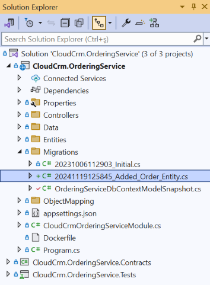
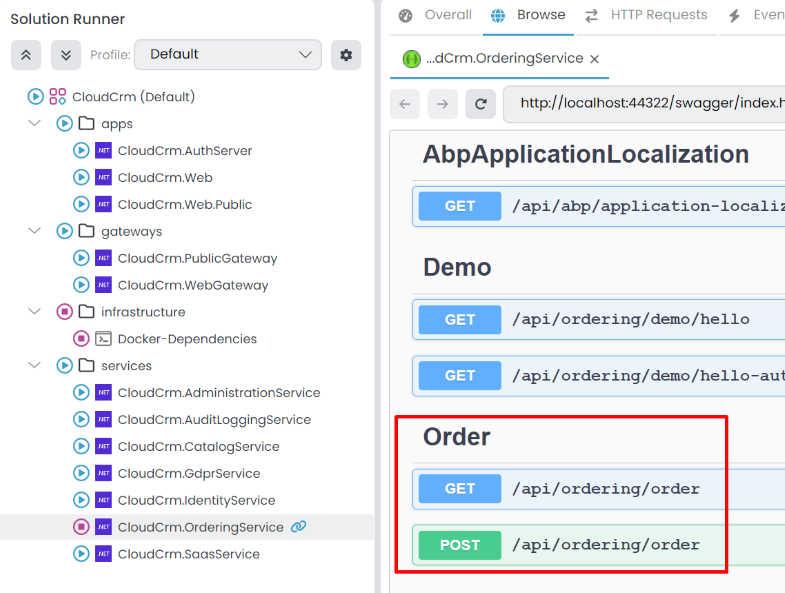
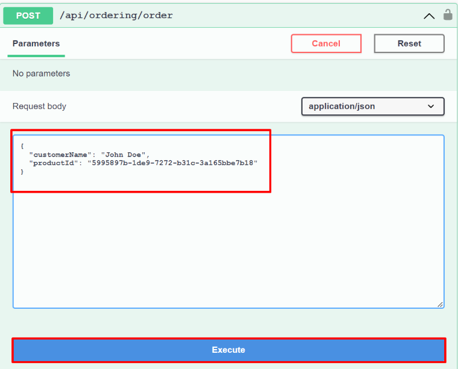
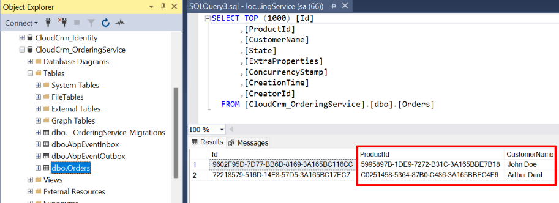
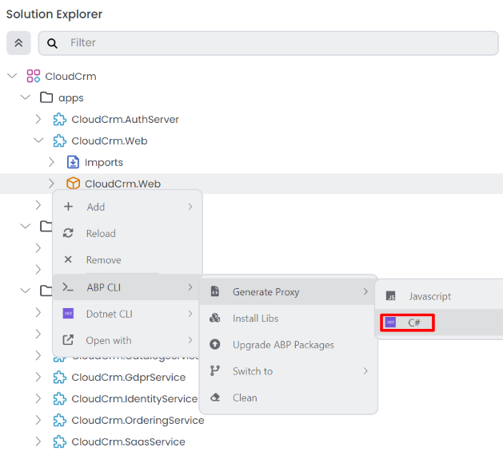
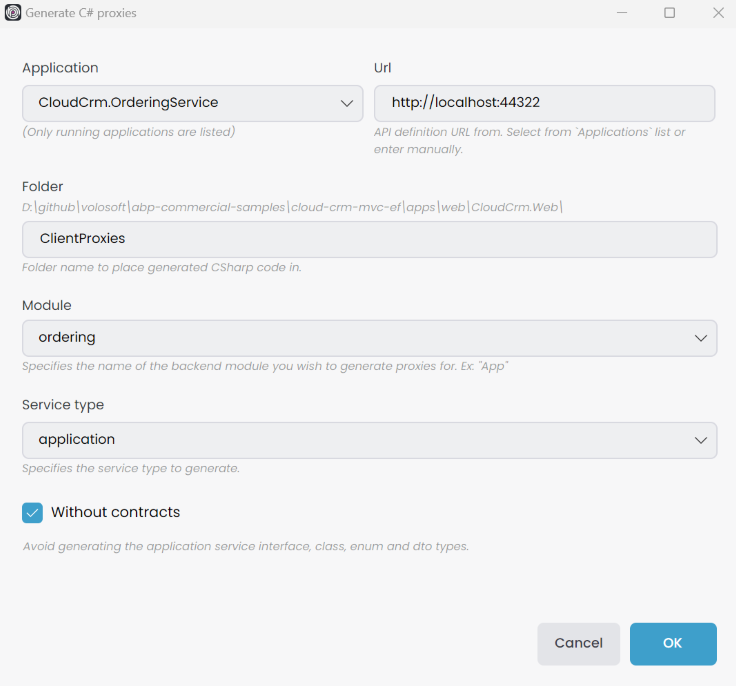
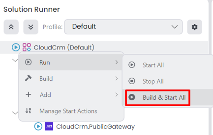

# Microservice Tutorial Part 05: Building the Ordering service

````json
//[doc-nav]
{
  "Previous": {
    "Name": "Creating the initial Ordering service",
    "Path": "tutorials/microservice/part-04"
  },
  "Next": {
    "Name": "Integrating the services: HTTP API Calls",
    "Path": "tutorials/microservice/part-06"
  }
}
````

In the previous part, we created the Ordering microservice. In this part, we will implement the functionality of the Ordering microservice manually. We will not use ABP Suite to generate the code. Instead, we will create the necessary code step by step to understand the details better.

## Creating the Order Entity

We will start by creating the `Order` entity, which will represent an order in our system. We'll add this entity to the `CloudCrm.OrderingService` project. Create a new folder named `Entities` and add a class named `Order` inside it:

```csharp
using CloudCrm.OrderingService.Enums;
using Volo.Abp.Domain.Entities.Auditing;

namespace CloudCrm.OrderingService.Entities;

public class Order : CreationAuditedAggregateRoot<Guid>
{
    public Guid ProductId { get; set; }
    public string CustomerName { get; set; }
    public OrderState State { get; set; }
}
```

To keep this example simple, we allow users to include only a single product within an order. The `Order` entity inherits from the [CreationAuditedAggregateRoot<>](../../framework/architecture/domain-driven-design/entities.md) class. This class, provided by the ABP Framework, includes common properties like `Id`, `CreationTime`, `CreatorId`, etc.

### Adding the OrderState Enum

We also need to define the `OrderState` enum. In the `CloudCrm.OrderingService.Contracts` project, create a folder named `Enums` and add an `OrderState` enum inside it:

```csharp
namespace CloudCrm.OrderingService.Enums;

public enum OrderState : byte
{
    Placed = 0,
    Delivered = 1,
    Canceled = 2
}
```

The final solution structure should look like this:


## Configuring the Database Mapping

First, we need to add the `Order` entity to the `OrderingServiceDbContext` class. Open the `OrderingServiceDbContext` class in the `CloudCrm.OrderingService` project, located in the `Data` folder, and add the following code to the `DbSet` properties:

```csharp
using CloudCrm.OrderingService.Entities;
using Microsoft.EntityFrameworkCore;
using Volo.Abp.Data;
using Volo.Abp.EntityFrameworkCore;
using Volo.Abp.EntityFrameworkCore.DistributedEvents;
using Volo.Abp.EntityFrameworkCore.Modeling;

namespace CloudCrm.OrderingService.Data;

[ConnectionStringName(DatabaseName)]
public class OrderingServiceDbContext :
    AbpDbContext<OrderingServiceDbContext>,
    IHasEventInbox,
    IHasEventOutbox
{
    public const string DbTablePrefix = "";
    public const string DbSchema = null;
    
    public const string DatabaseName = "OrderingService";
    
    public DbSet<IncomingEventRecord> IncomingEvents { get; set; }
    public DbSet<OutgoingEventRecord> OutgoingEvents { get; set; }
    public DbSet<Order> Orders { get; set; } // NEW: ADD DBSET PROPERTY

    // Code omitted for brevity
}
```

Next, we need to configure the database mapping for the `Order` entity. We'll use the [EF Core Fluent API](https://docs.microsoft.com/en-us/ef/core/modeling/relational/tables) for this configuration. In the `OrderingServiceDbContext` class add the following code to the `OnModelCreating` method:

```csharp
protected override void OnModelCreating(ModelBuilder builder)
{
    base.OnModelCreating(builder);

    builder.ConfigureEventInbox();
    builder.ConfigureEventOutbox();

    builder.Entity<Order>(b =>
    {
        // Configure table name
        b.ToTable("Orders");

        // Always call this method to set base entity properties
        b.ConfigureByConvention();

        // Properties of the entity
        b.Property(q => q.CustomerName).IsRequired().HasMaxLength(120);
    });
}
```

In this code snippet, we configure the `Order` entity to use the `Orders` table in the database. We also specify that the `CustomerName` property is required and has a maximum length of 120 characters.

### Add a Database Migration

Now, we can add a new database migration. You can use Entity Framework Core's `Add-Migration` (or `dotnet ef migrations add`) terminal command, but in this tutorial, we will use ABP Studio's shortcut UI.

Ensure that the solution has built. You can right-click the `CloudCrm.OrderingService` (under the `services` folder) on ABP Studio *Solution Explorer* and select the *Dotnet CLI* -> *Graph Build* command.

Right-click the `CloudCrm.OrderingService` package and select the *EF Core CLI* -> *Add Migration* command:


The *Add Migration* command opens a new dialog to get a migration name:


Once you click the *OK* button, a new database migration class is added to the `Migrations` folder of the `CloudCrm.OrderingService` project:



The changes will be applied to the database during the next application startup. For more details, refer to the [database migrations on service startup](../../solution-templates/microservice/database-configurations.md#database-migrations-on-service-startup) section.

## Creating the Application Service

Now, we will create the application service to manage the `Order` entity. 

### Defining the Application Service Contract

First, we need to define the application service contract under the `CloudCrm.OrderingService.Contracts` project. Return to your IDE, open the `CloudCrm.OrderingService` module's .NET solution and create an `IOrderAppService` interface under the `Services` folder for the `CloudCrm.OrderingService.Contracts` project:

```csharp
using System.Collections.Generic;
using System.Threading.Tasks;
using Volo.Abp.Application.Services;

namespace CloudCrm.OrderingService.Services;

public interface IOrderAppService : IApplicationService
{
    Task<List<OrderDto>> GetListAsync();
    Task CreateAsync(OrderCreationDto input);
}
```

### Defining the Data Transfer Objects

Next, we need to define the data transfer objects (DTOs) for the `Order` entity. The `GetListAsync` and `CreateAsync` methods will use these DTOs to communicate with the client applications. 

Create a `OrderCreationDto` class under the `Services` folder in the `CloudCrm.OrderingService.Contracts` project:

```csharp
using System;
using System.ComponentModel.DataAnnotations;

namespace CloudCrm.OrderingService.Services;

public class OrderCreationDto
{
    [Required]
    [StringLength(150)]
    public string CustomerName { get; set; }

    [Required]
    public Guid ProductId { get; set; }
}
```

Create a `OrderDto` class under the `Services` folder in the `CloudCrm.OrderingService.Contracts` project:

```csharp
using System;
using CloudCrm.OrderingService.Enums;

namespace CloudCrm.OrderingService.Services;

public class OrderDto
{
    public Guid Id { get; set; }
    public string CustomerName { get; set; }
    public Guid ProductId { get; set; }
    public OrderState State { get; set; }
}
```

The final solution structure should look like this:


## Implementing the Application Service

Now, we will implement the `IOrderAppService` interface in the `OrderAppService` class. Create an `OrderAppService` class under the `Services` folder in the `CloudCrm.OrderingService` project:

```csharp
using System;
using System.Collections.Generic;
using CloudCrm.OrderingService.Entities;
using CloudCrm.OrderingService.Enums;
using CloudCrm.OrderingService.Localization;
using Volo.Abp.Application.Services;
using Volo.Abp.Domain.Repositories;

namespace CloudCrm.OrderingService.Services;

public class OrderAppService : ApplicationService, IOrderAppService
{
    private readonly IRepository<Order, Guid>  _orderRepository;

    public OrderAppService(IRepository<Order, Guid> orderRepository)
    {
        LocalizationResource = typeof(OrderingServiceResource);
        _orderRepository = orderRepository;
    }

    public async Task<List<OrderDto>> GetListAsync()
    {
        var orders = await _orderRepository.GetListAsync();
        return ObjectMapper.Map<List<Order>, List<OrderDto>>(orders);
    }

    public async Task CreateAsync(OrderCreationDto input)
    {
        var order = new Order
        {
            CustomerName = input.CustomerName,
            ProductId = input.ProductId,
            State = OrderState.Placed
        };

        await _orderRepository.InsertAsync(order);
    }
}
```

In this code snippet, we inject the `IRepository<Order, Guid>` into the `OrderAppService` class. We use this repository to interact with the `Order` entity. The `GetListAsync` method retrieves a list of orders from the database and maps them to the `OrderDto` class. The `CreateAsync` method creates a new order entity and inserts it into the database.

Afterward, we need to configure the *AutoMapper* object to map the `Order` entity to the `OrderDto` class. Open the `OrderingServiceApplicationAutoMapperProfile` class in the `CloudCrm.OrderingService` project, located in the `ObjectMapping` folder, and add the following code:

```csharp
using AutoMapper;
using CloudCrm.OrderingService.Entities;
using CloudCrm.OrderingService.Services;

namespace CloudCrm.OrderingService.ObjectMapping;

public class OrderingServiceApplicationAutoMapperProfile : Profile
{
    public OrderingServiceApplicationAutoMapperProfile()
    {
        CreateMap<Order, OrderDto>();
    }
}
```

## Testing the Application Service

Now, we can test the `OrderAppService` class using the Swagger UI. Open the Solution Runner and right-click to `CloudCrm.OrderingService` project and select the *Run* -> *Build & Start* command. After the application starts, you can open the Swagger UI by clicking to the [Browse](../../studio/running-applications.md#monitoring) command:



Expand the `api/ordering/order` API and click the *Try it out* button. Then, create a few orders by filling in the request body and clicking the *Execute* button:



If you check the database, you should see the entities created in the `Orders` table:



> Since we're using the [Auto API Controller](../../framework/api-development/auto-controllers.md) we don't need to create a controller for the `OrderAppService`. The ABP Framework automatically creates an API controller for the `OrderAppService` class. You can find the configuration in the `CloudCrmOrderingServiceModule` class, in the `ConfigureAutoControllers` method of the `CloudCrm.OrderingService` project.

## Creating the User Interface

Now, we will create the user interface for the Ordering module. We will use the `CloudCrm.Web` project to create the user interface. Open the `CloudCrm.Web` .NET solution in your favorite IDE.

### Creating the Orders Page

Create a new `Orders` folder under the `Pages` folder in the `CloudCrm.Web` project. Then, create an `Index.cshtml` Razor Page inside that new folder and edit the `Index.cshtml.cs` file as follows:

```csharp
using CloudCrm.OrderingService.Services;
using Microsoft.AspNetCore.Mvc.RazorPages;
using Volo.Abp.AspNetCore.Mvc.UI.RazorPages;

namespace CloudCrm.Web.Pages.Orders;

public class Index : AbpPageModel
{
    public List<OrderDto> Orders { get; set; }

    private readonly IOrderAppService _orderAppService;

    public Index(IOrderAppService orderAppService)
    {
        _orderAppService = orderAppService;
    }

    public async Task OnGetAsync()
    {
        Orders = await _orderAppService.GetListAsync();
    }
}
```

Here, we inject the `IOrderAppService` into the `Index` Razor Page. We use this service to retrieve the list of orders from the database and assign them to the `Orders` property. Open the `Index.cshtml` file and add the following code:

```html
@page
@model CloudCrm.Web.Pages.Orders.Index

<h1>Orders</h1>

<abp-card>
    <abp-card-body>
        <abp-list-group>
            @foreach (var order in Model.Orders)
            {
                <abp-list-group-item>
                    <strong>Customer:</strong> @order.CustomerName <br />
                    <strong>Product:</strong> @order.ProductId <br />
                    <strong>State:</strong> @order.State
                </abp-list-group-item>
            }
        </abp-list-group>
    </abp-card-body>
</abp-card>
```

This page shows a list of orders on the UI. We haven't created a UI to create new orders, and we will not do it to keep this tutorial simple. If you want to learn how to create advanced UIs with ABP, please follow the [Book Store tutorial](../../tutorials/book-store/index.md).

### Generating the UI Proxy

To select the *Application* during proxy generation, ensure that the `CloudCrm.OrderingService` is *Started* beforehand. You can start the application using [Solution Runner](../../studio/running-applications.md).  

Now, we need to generate the [Static API Proxy](../../framework/api-development/static-csharp-clients.md) for the *Web* project. Right-click the *CloudCrm.Web* [package](../../studio/concepts.md#package) and select the *ABP CLI* -> *Generate Proxy* -> *C#* command:



It will open the *Generate C# Proxies* window. Select the `CloudCrm.OrderingService` application, and it will automatically populate the *URL* field. Choose the *ordering* module and service type is *application* lastly check the *Without contracts* checkbox, since we already have a dependency on the `CloudCrm.OrderingService.Contracts` package in the `CloudCrm.Web` project:



Lastly, we need to configure the use of a static HTTP client for the `OrderingService` in the `CloudCrm.Web` project. Open the `CloudCrmWebModule.cs` file in the `Web` project and add the following line to the `ConfigureServices` method:

```csharp
//...
using CloudCrm.OrderingService;

public override void ConfigureServices(ServiceConfigurationContext context)
{
    // Code omitted for brevity
    context.Services.AddStaticHttpClientProxies(
        typeof(CloudCrmOrderingServiceContractsModule).Assembly);
}
```

### Adding the Menu Item

> ABP provides a modular navigation [menu system](../../framework/ui/mvc-razor-pages/navigation-menu.md) that allows you to define the menu items in a modular way.

Finally, we need to add a menu item to the sidebar to navigate to the `Orders` page. Open the `CloudCrmMenus` file in the `Navigation` folder of the `CloudCrm.Web` project and edit with the following code:

```csharp
namespace CloudCrm.Web.Navigation;

public class CloudCrmMenus
{
    private const string Prefix = "CloudCrm";

    public const string Home = Prefix + ".Home";

    public const string HostDashboard = Prefix + ".HostDashboard";

    public const string TenantDashboard = Prefix + ".TenantDashboard";

    public const string Products = Prefix + ".Products";

    public const string Orders = Prefix + ".Orders"; // NEW: ADD MENU ITEM
}
```

Then, open the `CloudCrmMenuContributor` class in the `CloudCrm.Web` project, located in the `Navigation` folder, and add the following code to `ConfigureMainMenuAsync` method:

```csharp
private static async Task ConfigureMainMenuAsync(MenuConfigurationContext context)
{
    // Code omitted for brevity

    context.Menu.AddItem(
            new ApplicationMenuItem(
                CloudCrmMenus.Orders, // Unique menu id
                "Orders", // Menu display text
                "~/Orders", // URL
                "fa-solid fa-basket-shopping" // Icon CSS class
            )
        );
}
```

## Building and Running the Application

Now, we can build and run the application to see the changes. Please stop the applications if they are running. Then open the *Solution Runner* panel, right-click the `CloudCrm` root item, and select the *Run* -> *Build & Start* command:



After the applications are started, you can *Browse* and navigate to the `Orders` page to see the list of orders:


Great! We have successfully implemented the Ordering module. However, there is a problem:

- We see Product's GUID ID instead of its name. This is because the *Ordering* microservice has no integration with the *Catalog* microservice and doesn't have access to Product microservice's database to perform a JOIN query.

We will solve this problem in the next part by implementing an integration service between the *Ordering* and *Catalog* microservices.

## Summary

In this part, we implemented the Ordering module manually. We created the `Order` entity, the `OrderState` enum, the `OrderAppService` application service, and the user interface for the `Orders` page. We also added a menu item to the sidebar to navigate to the `Orders` page.