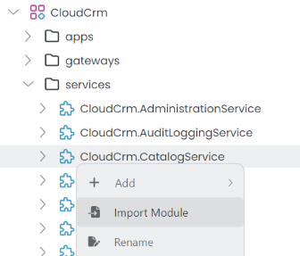
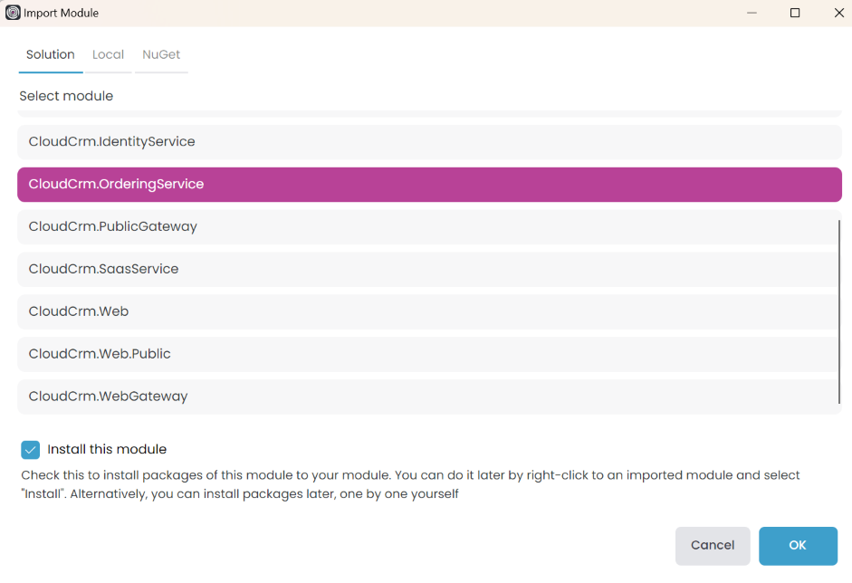
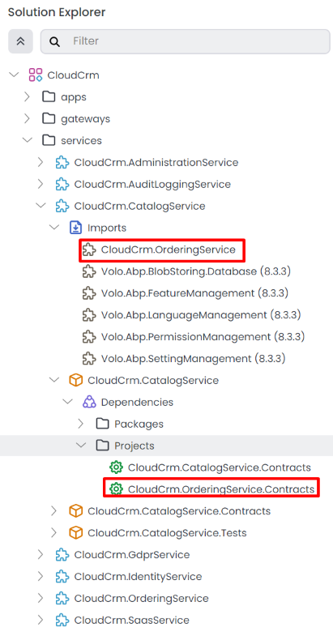
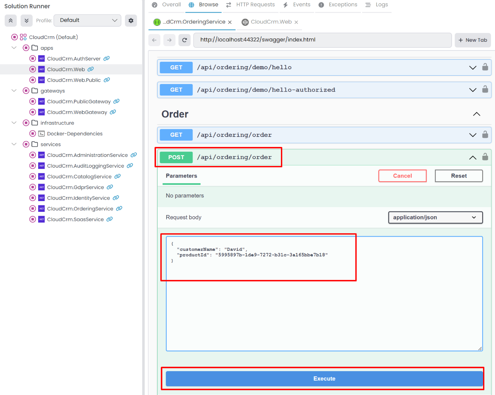

# Microservice Tutorial Part 07: Integrating the services: Using Distributed Events

````json
//[doc-nav]
{
  "Previous": {
    "Name": "Integrating the services: HTTP API Calls",
    "Path": "tutorials/microservice/part-06"
  }
}
````

Another common approach to communicating between microservices is messaging. By publishing and handling messages, a microservice can perform an operation when an event happens in another microservice.

ABP provides two types of event buses for loosely coupled communication:

* [Local Event Bus](../../framework/infrastructure/event-bus/local/index.md) is suitable for in-process messaging. However, it’s not suitable for microservices as it cannot communicate across different processes. For distributed systems, consider using a distributed event bus.

* [Distributed Event Bus](../../framework/infrastructure/event-bus/distributed/index.md) is normal for inter-process messaging, like microservices, for publishing and subscribing to distributed events. However, ABP's distributed event bus works as local (in-process) by default (actually, it uses the Local Event Bus under the hood by default) unless you configure an external message broker.

In this tutorial, we will use the distributed event bus to communicate between the `Order` and `Catalog` microservices.

## Publishing an Event

In the example scenario, we want to publish an event when a new order is placed. The Ordering service will publish the event since it knows when a new order is placed. The Catalog service will subscribe to that event and get notified when a new order is placed. This will decrease the stock count of the product related to the new order. The scenario is pretty simple; let's implement it.

### Defining the Event Class

Open the `CloudCrm.OrderingService` .NET solution in your IDE, create an `Events` folder and create a new class named `OrderPlacedEto` under the `CloudCrm.OrderingService.Contracts` project:

```csharp
using System;

namespace CloudCrm.OrderingService.Events;

public class OrderPlacedEto
{
    public string CustomerName { get; set; }
    public Guid ProductId { get; set; }
}
```

`OrderPlacedEto` is very simple. It is a plain C# class used to transfer data related to the event (*ETO* is an acronym for *Event Transfer Object*, a suggested naming convention but not required). You can add more properties if needed, but for this tutorial, it is more than enough.

### Using the `IDistributedEventBus` Service

The `IDistributedEventBus` service publishes events to the event bus. Until this point, the Ordering service only creates an Order and insert to database. Let's change that and publish `OrderPlacedEto` event, for that purpose open the `CloudCrm.OrderingService` project and update to the `OrderAppService` class as shown below:

```csharp
using System;
using System.Collections.Generic;
using System.Linq;
using System.Threading.Tasks;
using CloudCrm.CatalogService.IntegrationServices;
using CloudCrm.OrderingService.Entities;
using CloudCrm.OrderingService.Enums;
using CloudCrm.OrderingService.Events;
using CloudCrm.OrderingService.Localization;
using Volo.Abp.Application.Services;
using Volo.Abp.Domain.Repositories;
using Volo.Abp.EventBus.Distributed;

namespace CloudCrm.OrderingService.Services;

public class OrderAppService : ApplicationService, IOrderAppService
{
    private readonly IRepository<Order, Guid>  _orderRepository;
    private readonly IProductIntegrationService _productIntegrationService;
    private readonly IDistributedEventBus _distributedEventBus;

    public OrderAppService(
        IRepository<Order, Guid> orderRepository,
        IProductIntegrationService productIntegrationService,
        IDistributedEventBus distributedEventBus)
    {
        LocalizationResource = typeof(OrderingServiceResource);

        _orderRepository = orderRepository;
        _productIntegrationService = productIntegrationService;
        _distributedEventBus = distributedEventBus;
    }

    public async Task<List<OrderDto>> GetListAsync()
    {
        var orders = await _orderRepository.GetListAsync();

        // Prepare a list of products we need
        var productIds = orders.Select(o => o.ProductId).Distinct().ToList();
        var products = (await _productIntegrationService
                .GetProductsByIdsAsync(productIds))
            .ToDictionary(p => p.Id, p => p.Name);

        var orderDtos = ObjectMapper.Map<List<Order>, List<OrderDto>>(orders);

        orderDtos.ForEach(orderDto =>
        {
            orderDto.ProductName = products[orderDto.ProductId];
        });

        return orderDtos;
    }

    public async Task CreateAsync(OrderCreationDto input)
    {
        // Create a new Order entity
        var order = new Order
        {
            CustomerName = input.CustomerName,
            ProductId = input.ProductId,
            State = OrderState.Placed
        };

        // Save it to the database
        await _orderRepository.InsertAsync(order);

        // Publish an event so other microservices can be informed
        await _distributedEventBus.PublishAsync(
            new OrderPlacedEto
            {
                ProductId = order.ProductId,
                CustomerName = order.CustomerName
            });
    }
}
```
The `OrderAppService.CreateAsync` method creates a new `Order` entity, saves it to the database and finally publishes an `OrderPlacedEto` event.

## Subscribing to an Event

The Catalog service will subscribe to the `OrderPlacedEto` event and decrease the stock count of the product related to the new order. Let's implement it.

### Adding a Reference to the `CloudCrm.OrderingService.Contracts` Package

Since the `OrderPlacedEto` class is in the `CloudCrm.OrderingService.Contracts` project, we must add that package's reference to the Catalog service. This time, we will use the Import Module feature of ABP Studio (as an alternative to the approach we used in the Adding a Reference to the `CloudCrm.CatalogService.Contracts` Package section of the [previous part](./part-06.md#adding-a-reference-to-the-cloudcrmcatalogservicecontracts-package)).

Open the ABP Studio UI and stop the applications if they are running. Then, open the *Solution Explorer* panel and right-click on the `CloudCrm.CatalogService`. Select *Import Module* from the context menu:



In the opening dialog, find and select the `CloudCrm.OrderingService` module, check the *Install this module* option, click the *OK* button:



Once you click the OK button, the Ordering service is imported to the Catalog service. It opens the *Install Module* dialog:


Here, select the `CloudCrm.OrderingService.Contracts` package on the left side (because we want to add that package reference) and `CloudCrm.CatalogService` package on the middle area (because we want to add the package reference to that project).

You can check the ABP Studio's *Solution Explorer* panel to see the module and the project reference (dependency):



### Handling the `OrderPlacedEto` Event

Now, it's time to handle the `OrderPlacedEto` event in the Catalog service. Open the `CloudCrm.CatalogService` .NET solution in your IDE. Create a new `Orders` folder, and add a new class named `OrderEventHandler` inside that folder within the `CloudCrm.CatalogService` project:

```csharp
using System;
using System.Threading.Tasks;
using CloudCrm.CatalogService.Products;
using CloudCrm.OrderingService.Events;
using Volo.Abp.DependencyInjection;
using Volo.Abp.Domain.Repositories;
using Volo.Abp.EventBus.Distributed;

namespace CloudCrm.CatalogService.Orders;

public class OrderEventHandler :
    IDistributedEventHandler<OrderPlacedEto>,
    ITransientDependency
{
    private readonly IProductRepository _productRepository;

    public OrderEventHandler(IProductRepository productRepository)
    {
        _productRepository = productRepository;
    }

    public async Task HandleEventAsync(OrderPlacedEto eventData)
    {
        // Find the related product
        var product = await _productRepository.FindAsync(eventData.ProductId);
        if (product == null)
        {
            return;
        }

        // Decrease the stock count
        product.StockCount = product.StockCount - 1;

        // Update the entity in the database
        await _productRepository.UpdateAsync(product);
    }
}
```

The `OrderEventHandler` class implements the `IDistributedEventHandler<OrderPlacedEto>` interface to handle the `OrderPlacedEto` event. When the event is published, the `HandleEventAsync` method is called. In this method, we find the related product, decrease the stock count by one, and update the entity in the database.

Implementing `ITransientDependency` registers the `OrderEventHandler` class to the dependency injection system as a transient object.

### Testing the Order Creation

To keep this tutorial simple, we will not implement a user interface for creating orders. Instead, we will use the Swagger UI to create an order. Open the *Solution Runner* panel in ABP Studio and use *Build & Start* to launch the `CloudCrm.OrderingService` and `CloudCrm.CatalogService` applications. Then, go to *Run* -> *Start All* to start the remaining applications listed in the [Solution Runner root item](../../studio/running-applications.md#run).

Once the application is running and ready, [Browse](../../studio/running-applications.md#c-application) the `CloudCrm.OrderingService` application. Use the `POST /api/ordering/order` endpoint to create a new order:



Find the *Order* API, click the *Try it out* button, enter a sample value the *Request body* section, and click the *Execute* button:

```json
{
  "customerName": "David",
  "productId": "5995897b-1de9-7272-b31c-3a165bbe7b18"
}
```

> **IMPORTANT:** Here, you should type a valid Product Id from the Products table of your database!

Once you press the *Execute* button, a new order is created. At that point, you can check the `/Orders` page to see if the new order is listed. You can also check the `/Products` page to see if the stock count of the related product is decreased by one in the `CloudCrm.Web` application.

Here are sample screenshots from the Orders and Products pages of the `CloudCrm.Web` application:


We placed a new order for *Product A*. As a result, the stock count of *Product A* is decreased from 53 to 52 and a new line is added to the Orders page.

## Conclusion

In this tutorial, we used the distributed event bus to communicate between the `Order` and `Catalog` microservices. We published an event when a new order is placed and handled that event in the Catalog service to decrease the stock count of the related product. This is a simple example, but it shows how you can use distributed events to communicate between microservices.