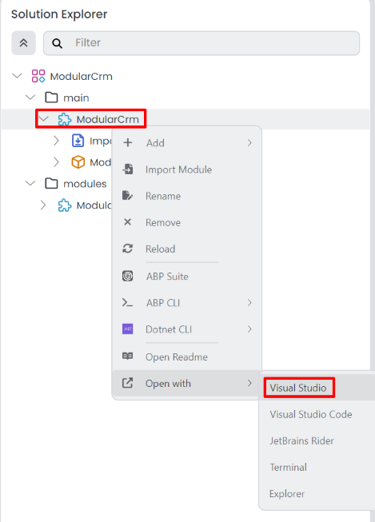
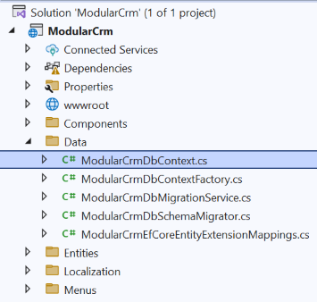
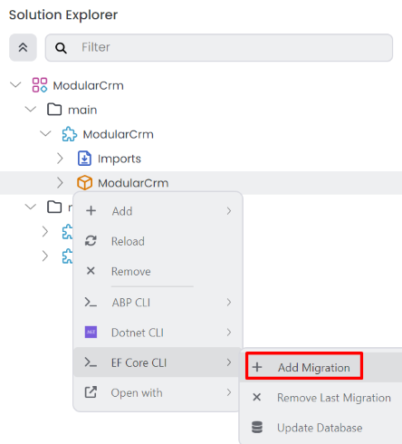
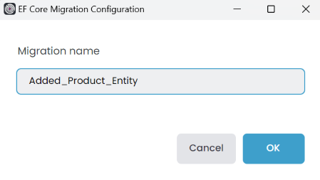
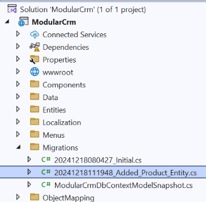
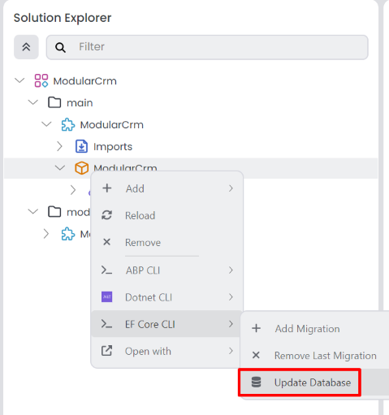
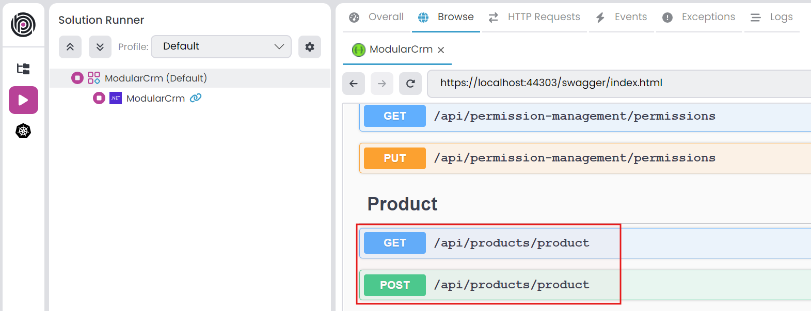
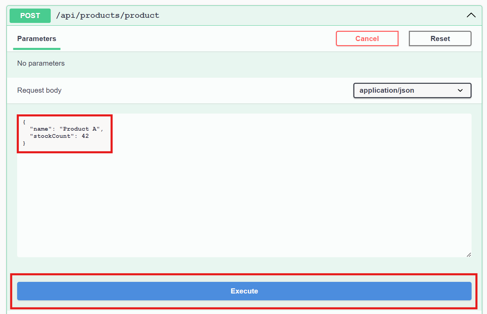
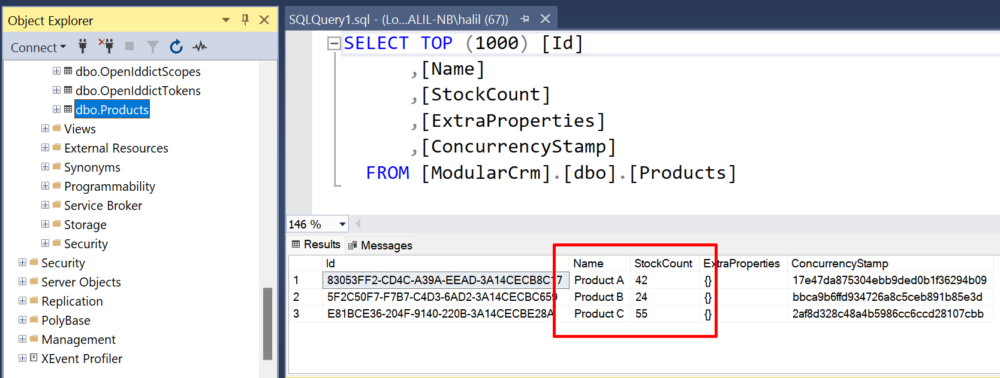
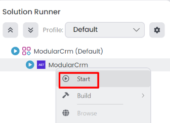

# Building the Products Module

````json
//[doc-nav]
{
  "Previous": {
    "Name": "Creating the initial Products module",
    "Path": "tutorials/modular-crm/part-02"
  },
  "Next": {
    "Name": "Creating the initial Ordering module",
    "Path": "tutorials/modular-crm/part-04"
  }
}
````

In this part, you will learn how to create entities and services and a basic user interface for the products module.

> **This module's functionality will be minimal to focus on modularity.** You can follow the [Book Store tutorial](../book-store/index.md) to learn building more real-world applications with ABP.

If it is still running, please stop the web application before continuing with the tutorial.

## Creating a `Product` Entity

Open the `ModularCrm.Products` module in your favorite IDE. You can right-click the `ModularCrm.Products` module and select the *Open With* -> *Visual Studio* command to open the `ModularCrm.Products` module's .NET solution with Visual Studio. If you can not find your IDE in the *Open with* list, open with the *Explorer*, then open the `.sln` file with your IDE:


The `ModularCrm.Products` .NET solution should look like the following figure:


Add a new `Product` class under the `ModularCrm.Products.Domain` project (Right-click the `ModularCrm.Products.Domain` project, select *Add* -> *Class*):

````csharp
using System;
using Volo.Abp.Domain.Entities;

namespace ModularCrm.Products;

public class Product : AggregateRoot<Guid>
{
    public string Name { get; set; }
    public int StockCount { get; set; }
}
````

## Mapping Entity to Database

The next step is to configure the Entity Framework Core `DbContext` class and the database for the new entity.

### Add a `DbSet` Property

Open the `ProductsDbContext` in the `ModularCrm.Products.EntityFrameworkCore` project and add a new `DbSet` property for the `Product` entity. The final `ProductsDbContext.cs` file content should be the following:

````csharp
using Microsoft.EntityFrameworkCore;
using Volo.Abp.Data;
using Volo.Abp.EntityFrameworkCore;

namespace ModularCrm.Products.EntityFrameworkCore;

[ConnectionStringName(ProductsDbProperties.ConnectionStringName)]
public class ProductsDbContext : AbpDbContext<ProductsDbContext>, IProductsDbContext
{
    public DbSet<Product> Products { get; set; } //NEW: DBSET FOR THE PRODUCT ENTITY

    public ProductsDbContext(DbContextOptions<ProductsDbContext> options)
        : base(options)
    {

    }

    protected override void OnModelCreating(ModelBuilder builder)
    {
        base.OnModelCreating(builder);
        builder.ConfigureProducts();
    }
}
````

The `ProductsDbContext` class implements the `IProductsDbContext` interface. Add the following property to the `IProductsDbContext` interface:

````csharp
DbSet<Product> Products { get; set; }
````

The final `IProductsDbContext` interface should be the following:

````csharp
using Microsoft.EntityFrameworkCore;
using Volo.Abp.Data;
using Volo.Abp.EntityFrameworkCore;

namespace ModularCrm.Products.EntityFrameworkCore;

[ConnectionStringName(ProductsDbProperties.ConnectionStringName)]
public interface IProductsDbContext : IEfCoreDbContext
{
    DbSet<Product> Products { get; set; }
}
````

Having such an `IProductsDbContext` interface allows us to decouple our repositories (and other classes) from the concrete `ProductsDbContext` class. This provides flexibility to the final application to merge multiple `DbContext`s into a single `DbContext` to manage database migrations easier and have a database level transaction support for multi-module database operations.

### Configure the Table Mapping

The DDD module template is designed to be flexible so that your module can have a separate physical database or store its tables inside another database, like the main database of your application. To make that possible, it configures the database mapping in an extension method (`ConfigureProducts`) called inside the `OnModelCreating` method above. Find that extension method (in the `ProductsDbContextModelCreatingExtensions` class) and change its content as the following code block:

````csharp
using Microsoft.EntityFrameworkCore;
using Volo.Abp;
using Volo.Abp.EntityFrameworkCore.Modeling;

namespace ModularCrm.Products.EntityFrameworkCore;

public static class ProductsDbContextModelCreatingExtensions
{
    public static void ConfigureProducts(
        this ModelBuilder builder)
    {
        Check.NotNull(builder, nameof(builder));

        builder.Entity<Product>(b =>
        {
            //Configure table & schema name
            b.ToTable(ProductsDbProperties.DbTablePrefix + "Products",
                      ProductsDbProperties.DbSchema);

            //Always call this method to setup base entity properties
            b.ConfigureByConvention();

            //Properties of the entity
            b.Property(q => q.Name).IsRequired().HasMaxLength(100);
        });
    }
}
````

First, we are setting the database table name with the `ToTable` method. `ProductsDbProperties.DbTablePrefix` defines a constant that is added as a prefix to all database table names of this module. If you see the `ProductsDbProperties` class (in the `ModularCrm.Products.Domain` project), `DbTablePrefix` value is `Products`. In that case, the table name for the `Product` entity will be `ProductsProducts`. That is unnecessary for such a simple module; we can remove that prefix. So, you can change the `ProductsDbProperties` class with the following content to set an empty string to the `DbTablePrefix` property:

````csharp
namespace ModularCrm.Products;

public static class ProductsDbProperties
{
    public static string DbTablePrefix { get; set; } = "";
    public static string? DbSchema { get; set; } = null;
    public const string ConnectionStringName = "Products";
}
````

You can set a `DbSchema` to collect a module's tables under a separate schema (if your DBMS supports it) or use a `DbTablePrefix` as a prefix for all module table names. We won't set any of them for this tutorial.

At that point, build the `ModularCrm.Products` .NET solution in your IDE (or ABP Studio UI). We will switch to the main application's .NET solution.

### Configuring the Main Application Database

We changed the Entity Framework Core configuration. The next step should be adding a new code-first database migration and updating the database so the new Products table is created on the database.

We are not managing the database migrations in the module. Instead, the main application decides which DBMS (Database Management System) to use and how to share physical database(s) among modules. We will store all the modules' data in a single physical database to simplify this tutorial.

Open the `ModularCrm` module (which is the main application) in your IDE:



Open the `ModularCrmDbContext` class under the `ModularCrm` project `Data` folder:



We will merge module's database configuration into `ModularCrmDbContext`.

#### Replace the `IProductsDbContext` Service

Follow the three steps below;

**(1)** Add the following attribute on top of the `ModularCrmDbContext` class:

````csharp
[ReplaceDbContext(typeof(IProductsDbContext))]
````

`ReplaceDbContext` attribute makes it possible to use the `ModularCrmDbContext` class in the services in the Products module.

**(2)** Implement the `IProductsDbContext` by the `ModularCrmDbContext` class:

````csharp
[ReplaceDbContext(typeof(IProductsDbContext))]
public class ModularCrmDbContext :
    AbpDbContext<ModularCrmDbContext>,
    IProductsDbContext //NEW: IMPLEMENT THE INTERFACE
{
    public DbSet<Product> Products { get; set; } //NEW: ADD DBSET PROPERTY
	...
}
````

**(3)** Finally, call the `ConfigureProducts()` extension method inside the `OnModelCreating` method after other `Configure...` module calls:

````csharp
protected override void OnModelCreating(ModelBuilder builder)
{
    ...
    builder.ConfigureProducts(); //NEW: CALL THE EXTENSION METHOD
}
````

In this way, `ModularCrmDbContext` can be used by the products module over the `IProductsDbContext` interface. This part is only needed once for a module. Next time, you can add a new database migration, as explained in the next section.

#### Add a Database Migration

Now, we can add a new database migration. You can use Entity Framework Core's `Add-Migration` (or `dotnet ef migrations add`) terminal command, but we will use ABP Studio's shortcut UI in this tutorial.

Ensure that the solution has built. You can right-click the `ModularCrm` (under the `main` folder) on ABP Studio *Solution Runner* and select the *Dotnet CLI* -> *Graph Build* command.

Right-click the `ModularCrm` package and select the *EF Core CLI* -> *Add Migration* command:



The *Add Migration* command opens a new dialog to get a migration name:



Once you click the *OK* button, a new database migration class is added to the `Migrations` folder of the `ModularCrm` project:



Now, you can return to ABP Studio, right-click the `ModularCrm.EntityFrameworkCore` project and select the *EF Core CLI* -> *Update Database* command:



After the operation completes, you can check your database to see the new `Products` table has been created:


## Creating the Application Service

Now, we will create an [application service](../../framework/architecture/domain-driven-design/application-services.md) to perform some use cases related to products.

### Defining the Application Service Contract

Return to your IDE (e.g. Visual Studio), open the `ModularCrm.Products` module's .NET solution and create an `IProductAppService` interface under the `ModularCrm.Products.Application.Contracts` project:

````csharp
using System.Collections.Generic;
using System.Threading.Tasks;
using Volo.Abp.Application.Services;

namespace ModularCrm.Products;

public interface IProductAppService : IApplicationService
{
    Task<List<ProductDto>> GetListAsync();
    Task CreateAsync(ProductCreationDto input);
}
````

We are defining application service interfaces and [data transfer objects](../../framework/architecture/domain-driven-design/data-transfer-objects.md) in the `Application.Contracts` project. That way, we can share those contracts with clients without sharing the actual implementation class.

### Defining Data Transfer Objects

The `GetListAsync` and `CreateAsync` methods use the `ProductDto` and `ProductCreationDto` classes, which have not been defined yet. So, we need to define them.

Create a `ProductCreationDto` class under the `ModularCrm.Products.Application.Contracts` project:

````csharp
using System.ComponentModel.DataAnnotations;

namespace ModularCrm.Products;

public class ProductCreationDto
{
    [Required]
    [StringLength(100)]
    public string Name { get; set; }

    [Range(0, int.MaxValue)]
    public int StockCount { get; set; }
}
````

And create a `ProductDto` class under the `ModularCrm.Products.Application.Contracts` project:

````csharp
using System;

namespace ModularCrm.Products
{
    public class ProductDto
    {
        public Guid Id { get; set; }
        public string Name { get; set; }
        public int StockCount { get; set; }
    }
}
````

The new files under the `ModularCrm.Products.Application.Contracts` project are shown below:


### Implementing the Application Service

Now, we can implement the `IProductAppService` interface. Create a `ProductAppService` class under the `ModularCrm.Products.Application` project:

````csharp
using System;
using System.Collections.Generic;
using System.Threading.Tasks;
using Volo.Abp.Domain.Repositories;

namespace ModularCrm.Products;

public class ProductAppService : ProductsAppService, IProductAppService
{
    private readonly IRepository<Product, Guid> _productRepository;

    public ProductAppService(IRepository<Product, Guid> productRepository)
    {
        _productRepository = productRepository;
    }

    public async Task<List<ProductDto>> GetListAsync()
    {
        var products = await _productRepository.GetListAsync();
        return ObjectMapper.Map<List<Product>, List<ProductDto>>(products);
    }

    public async Task CreateAsync(ProductCreationDto input)
    {
        var product = new Product
        {
            Name = input.Name,
            StockCount = input.StockCount
        };

        await _productRepository.InsertAsync(product);
    }
}
````

Notice that `ProductAppService` class implements the `IProductAppService` and also inherits from the `ProductsAppService` class. Do not be confused about the naming (`ProductAppService` and `ProductsAppService`). The `ProductsAppService` is a base class. It makes a few configurations for [localization](../../framework/fundamentals/localization.md) and [object mapping](../../framework/infrastructure/object-to-object-mapping.md) (you can see in the `ModularCrm.Products.Application` project). You can inherit all of your application services from that base class. This way, you can define some common properties and methods to share among all your application services. You can rename the base class if you feel that you may be confused later.

#### Object Mapping

`ProductAppService.GetListAsync` method uses the `ObjectMapper` service to convert `Product` entities to `ProductDto` objects. The mapping should be configured. Open the `ProductsApplicationAutoMapperProfile` class in the `ModularCrm.Products.Application` project and change it to the following code block:

````csharp
using AutoMapper;

namespace ModularCrm.Products;

public class ProductsApplicationAutoMapperProfile : Profile
{
    public ProductsApplicationAutoMapperProfile()
    {
        CreateMap<Product, ProductDto>();
    }
}
````

We've added the `CreateMap<Product, ProductDto>();` line to define the mapping.

### Exposing Application Services as HTTP API Controllers

For this application, we don't need to create HTTP API endpoints for the products module. But it is good to understand how to do it when you need it. You have two options;

* You can create a regular ASP.NET Core Controller class in the `ModularCrm.Products.HttpApi` project, inject `IProductAppService` and use it to create wrapper methods. We will do this later while we create the Ordering module.
* Alternatively, you can use the ABP's [Auto API Controllers](../../framework/api-development/auto-controllers.md) feature to expose your application services as API controllers by conventions. We will do it here.

Open the `ModularCrmModule` class in the main application's solution (the `ModularCrm` solution), find the `PreConfigureServices` method and add the following lines inside that method:

````csharp
PreConfigure<IMvcBuilder>(mvcBuilder =>
{
    mvcBuilder.AddApplicationPartIfNotExists(typeof(ProductsApplicationModule).Assembly);
});
````

This will tell the ASP.NET Core to explore the given assembly to discover controllers.

Then open the `ConfigureAutoApiControllers` method of the same class and add a second `ConventionalControllers.Create` call as shown in the following code block:

````csharp
Configure<AbpAspNetCoreMvcOptions>(options =>
{
    options.ConventionalControllers.Create(typeof(ModularCrmModule).Assembly);

    //ADD THE FOLLOWING LINE:
    options.ConventionalControllers.Create(typeof(ProductsApplicationModule).Assembly);
});
````

This will tell the ABP framework to create API controllers for the application services in the assembly.

> We made these configurations in the main application's solution since there is no project in the product module's solution that references ASP.NET Core MVC packages and uses the product module's application layer. If you add a reference of `ModularCrm.Products.Application` to `ModularCrm.Products.HttpApi`, then you can move these configurations to the `ModularCrm.Products.HttpApi` project.

Now, ABP will automatically expose the application services defined in the `ModularCrm.Products.Application` project as API controllers. The next section will use these API controllers to create some example products.

### Creating Example Products

This section will create a few example products using the [Swagger UI](../../framework/api-development/swagger.md). Thus, we will have some sample products to show on the UI.

Now, right-click the `ModularCrm` under the `main` folder in the Solution Explorer panel and select the *Dotnet CLI* -> *Graph Build* command. This will ensure that the product module and the main application are built and ready to run.

After the build process completes, open the Solution Runner panel and click the *Play* button near the solution root. Once the `ModularCrm` application runs, we can right-click it and select the *Browse* command to open the user interface.

Once you see the user interface of the web application, type `/swagger` at the end of the URL to open the Swagger UI. If you scroll down, you should see the `Products` API:



Expand the `/api/app/product` API and click the *Try it out* button as shown in the following figure:


Then, create a few products by filling in the *Request body* and clicking the *Execute* button:



If you check the database, you should see the entities created in the `Products` table:



We've some entities in the database; we can show them on the user interface now.

## Creating the User Interface

In this section, we will create a very simple user interface to demonstrate how to build UI in the products module and make it work in the main application.

As a first step, you can stop the application on ABP Studio's Solution Runner if it is currently running.

Open the `ModularCrm.Products` .NET solution in your IDE, and find the `Pages/Products/Index.cshtml` file under the `ModularCrm.Products.Web` project:


Replace the `IndexModel.cshtml.cs` file with the following content:

````csharp
using System.Collections.Generic;
using System.Threading.Tasks;

namespace ModularCrm.Products.Web.Pages.Products;

public class IndexModel : ProductsPageModel
{
    public List<ProductDto> Products { get; set; }

    private readonly IProductAppService _productAppService;

    public IndexModel(IProductAppService productAppService)
    {
        _productAppService = productAppService;
    }

    public async Task OnGetAsync()
    {
        Products = await _productAppService.GetListAsync();
    }
}
````

Here, we simply use the `IProductAppService` to get a list of all products and assign the result to the `Products` property. We can use it in the `Index.cshtml` file to show a simple list of products on the UI:

````xml
@page
@using Microsoft.Extensions.Localization
@using ModularCrm.Products.Localization
@using ModularCrm.Products.Web.Pages.Products
@model ModularCrm.Products.Web.Pages.Products.IndexModel
@inject IStringLocalizer<ProductsResource> L

<h1>Products</h1>

<abp-card>
    <abp-card-body>
        <abp-list-group>
            @foreach (var product in Model.Products)
            {
                <abp-list-group-item>
                    @product.Name <span class="text-muted">(stock: @product.StockCount)</span>
                </abp-list-group-item>
            }
        </abp-list-group>
    </abp-card-body>
</abp-card>
````

Right-click the `ModularCrm` application on ABP Studio's solution runner and select the *Build & Restart* command:



Now, you can browse the *Products* page to see the list of the products:


As you can see, developing a UI page in a modular ABP application is pretty straightforward. We kept the UI very simple to focus on modularity. To learn how to build complex application UIs, please check the [Book Store Tutorial](../book-store/index.md).

## Final Notes

Some of the projects in the product module's .NET solution (`ModularCrm.Products`) are not necessary for most of the cases. They are available to support different scenarios. You can delete them from your module (and remove the dependencies on the main application) if you want:

* `ModularCrm.Products.HttpApi`: This project aims to define regular HTTP API controllers. If you will always use ABP's [Auto API Controllers](../../framework/api-development/auto-controllers.md) feature (like we did in this tutorial), you can delete that project.
* `ModularCrm.Products.HttpApi.Client`: That project is generally shared with 3rd-party applications, so they can easily consume your HTTP API endpoints. In a modular monolith application, you typically don't need it.
* `ModularCrm.Products.HttpApi.Installer`: That project is used to discover and install a multi-projects module (like the product module) when you deploy it to a package management system (like NuGet). If you use the module with local project references (like we did here), you can delete that project.
* You can also delete the test projects (there are 4 of them in the solution) if you don't prefer to write unit/integration tests in the module's solution (Legal warning: it is recommended to write tests &#128522;)
